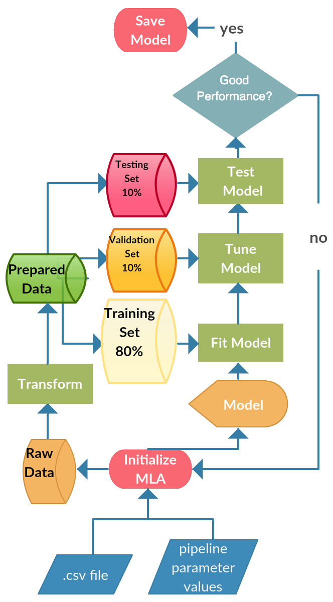

# Machine Learning Automator



**Machine Learning Automator** (aka MLA)  is an open source machine learning pipeline builder useful for generating classifiers for natural language classification tasks. It enables the user to input a csv or xlsx file, specify the feature and label columns, and then automates the process of generating a classifier using the Sci-Kit Learn framework. This software was developed for my Senior Capstone at the **New Jersey Institute of Technology** and was used to generate a classifier that performed at 98% macro-F1 score (binary classification) for Pfizer's Global Clinical Supply department.

## Getting Started

These instructions will get you a copy of the project up and running on your local machine for development and testing purposes.

### Prerequisites

[Python3.7](www.python.org/downloads) or newer.


### Installing

Clone this repo to your environment. Hit the download button or from the terminal type:
```
git clone https://github.com/TadayoshiCarvajal/MachineLearningAutomator
```

## Deployment

Follow these instructions for a quick and dirty use of the code from within the project directory. 

1. Place the data file into the input_files directory.
2. Run the following terminal command:
```
python main.py file_name.csv description_column_name label_column_name
```
> `Note`: Replace file_name.csv with the actual name of the data file, description_column_name with the name of the column containing the natural language text (features), and label_column_name with the name of the column containing the labels that the classifiers should try to predict.

If all goes according to plan, you will eventually be prompted to save the model.

3. To run a demonstration of testing out a model that you've saved, run:
```
python test.py models/model.p
```
> `Note`: Replace models/model.p with the relative path to the pickle file generated in step 2.

## Built With

requirements.txt
```
cycler==0.10.0
joblib==0.14.1
kiwisolver==1.1.0
matplotlib==3.1.2
nltk==3.4.5
numpy==1.17.4
pandas==0.25.3
pyenchant==2.0.0
pyparsing==2.4.5
python-dateutil==2.8.1
pytz==2019.3
scikit-learn==0.22
scipy==1.3.3
six==1.13.0
sklearn==0.0
textblob==0.15.3
tqdm==4.40.2
```

## Authors

* **Tadayoshi Carvajal** - *Initial work* - [TadayoshiCarvajal](https://github.com/TadayoshiCarvajal)

## License

This project is licensed under the MIT License - see the [LICENSE.md](pomcli/resources/LICENSE.md) file for details

## Acknowledgments

* Hat tip to the creators and contributors of Sci-Kit Learn, numpy, python, tqdm, and anyone else who assisted in making this project a reality. 
